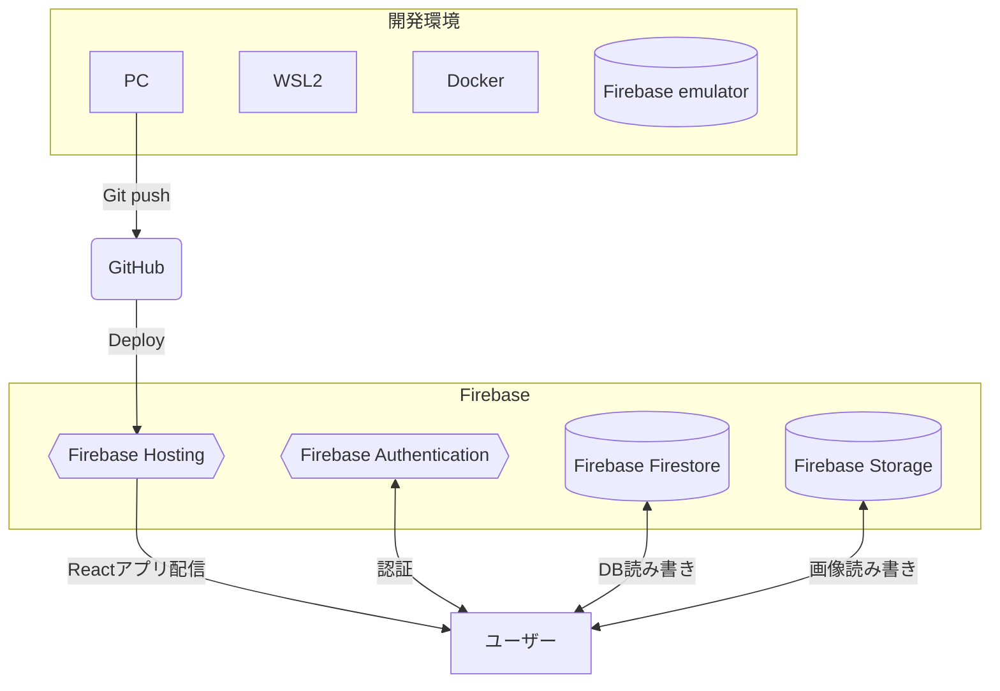

# 職務経歴書

## 基本情報

|key|value|
|---|---|
|氏名|荒木 裕登|
|ふりがな|あらき ゆうと|
|生年月日|1992年1月1日|
|居住地|東京都大田区|
|最終学歴|明治大学食料環境政策学科卒|
|エンジニア歴| 2019年11月～ |
|GitHub| <a src="https://github.com/ucho456" target="_blank">https://github.com/ucho456</a> |

  

## 業務経験のあるスキル（経験年数）
#### 言語
- Javascript （4年）
- Typescript （3年）

#### フロントエンドフレームワーク
- Next.js （1年）
- Vue.js （3年）

#### バックエンドフレームワーク
- Express （3年）
- Nest.js （1年)

#### データベース
- MySQL （3年）
- PostgreSQL （1年）
- Redis（1年）

  

## 職務経歴詳細

## 株式会社EARTHBRAIN（2022/11 ~ 現在）

### 建設業界のDX化を推進するIoTプラットフォームのリプレイス
建設現場から集約したデータを処理し見える化するプラットフォームのOpenAPIの開発や認可サーバーのフロントエンド開発を担当しました。

#### 技術スタック
Typescript, Node.js(FW: Nest.js, ORM: Prisma), PostgreSQL, Next.js, GCP

Slack, Jira, Notion, Miro, Box, Gather, Figma, Story book

#### チーム構成
- バックエンド（以後BE）チーム在籍時はPM1名 TL3名 コーダー10名前後でコーダーを担当。
- 認可サーバーのフロントエンド（以後FE）開発チーム時はPM1名 TL1名 コーダー5名でTLを担当。

#### 担当した役割
- OpenAPIの開発

  Nest.jsを使用してIoTプラットフォームに使うOpenAPIの開発・テスト・バグ改修・性能改善・ログ設計などを行いました。

- 認可サーバーのFE開発

  TLとして認可サーバーのFE開発を行いました。

#### 発揮したバリュー
- FEチームの中心となって開発

  認可サーバーのFE開発でいくつか提案を行った事で信頼を得て、TLを任せて頂きました。提案の一例として、開発当初案では、Next.jsで静的ファイルをexportし、それをGinのTemplateEngineに組み込む為に実装を追加するという方式でした。しかしこの方式だとFEを変更する度に組み込み実装が発生し保守性が悪く、また多言語対応なども認可サーバー側で行う必要があるなど課題がありました。そこでCSRに切り替えて以下のメリットを受けれるように提案しました。
  1. CSR化する事でFE側で動的に状態変化できるようにし、Next.jsとGinを疎結合にする。これにより並行開発を行いやすくする。
  2. 多言語対応をFE側の責務にできる。

  また動的インポートを活用し、不要なJSを取得しないよう調整することでCSRのデメリットにも対応しました。このようないくつかの提案で信頼を得ることができ、TLとしてコーディング規約作成やpackageの選定、テスト設計、スケジュール管理、認可サーバーとのインターフェイス調整など色々な業務を担当させて頂きました。

- コンポーネントのパッケージ化

  プラットフォームのFEと認可サーバーのFEのデザイン統一の為に、部品コンポーネントのコードだけを渡されていました。しかし二重管理するのは嫌だなと感じた為、Github packagesを使用してコンポーネントのパッケージ化を提案し実装しました。これによりコンポーネントを一元管理できるようにしました。またStory bookを使用して部品コンポーネントのカタログ化をすることでデザインチームとのコミュニケーション改善に役立てて頂いたり、reg-suitを使用してVisual Regression Testingを行えるようにしました。

  

## 会社名：ピクオス株式会社（2019/11〜2022/10）

### 動物病院向けクラウド型レセコンサービスの開発
予約・電子カルテ・保険請求・会計・データ分析など動物病院が業務に必要な機能がシームレスに使用できるクラウド型レセコンサービスの新規開発を担当しました。

#### 技術スタック
Javascript, Typescript, Vue.js v2, Node.js(FW: Express, ORM: Sequelize), MySQL, GCP

Teams, Trello, Redmine

#### チーム構成
PO1名、PM兼TL1名、コーダー4名のコーダー担当。

#### 担当した役割
要件定義・基本設計・詳細設計・フロントエンド開発・バックエンド開発・テスト・コードレビュー・運用保守など必要に応じて色々と担当しました。

#### 発揮したバリュー
- FEの様々なUIを実装

  未経験で入社していた背景もあり目新しいUIの実装が必要なものは積極的に担当して学ぼうとしていました。要件に合わせてパッケージ選定を行ったり、一から実装したりと様々なUIを開発しました。一例として
  1. 予約管理に使用するカレンダー
  2. Canvasを使用した電子カルテの画像編集機能
  3. 電子カルテ作成用のリッチテキストエディタ
  4. Chart.jsを使用してデータ分析に使用するグラフ
  5. CSVからデータを取り込んでそれを表に反映し、編集できる機能

  などが挙げられます。
  
- 非正規化によるDB設計の改善

  電子カルテの機能では変更履歴を管理する必要ありました。当初のDB設計では電子カルテの変更履歴のレコードに周辺データ（薬など）を正規化して管理していました。しかしその周辺データも変更が行われた時の為に変更履歴を管理する必要があり、正規化していると多くのテーブルで変更履歴を管理していく事になる為、仕様がどんどん複雑化していきました。そこでカルテの変更履歴を管理する専用のテーブルを非正規化してもつ仕様に変更を提案しました。結果として変更履歴を持つ必要があるものが電子カルテのテーブルのみで良くなり、また電子カルテを表示する為に大量のJOINをする必要も無くなった事でシンプルにすることができました。
 

  

## 個人開発

## Lite chat
React * Firebase * WebRTCを使った、ランダムでマッチした相手とチャットやビデオ通話を楽しめるコミュニケーションサービスです。業務でNext.jsを使用する事になったのでReactの知見を深める為の一環として自分のサービスを作成してみました。題材にチャットサービスを選んだ理由は、<a src="https://www.gather.town/" target="_blank">Gather</a>というサービスのセンスが好きでWebRTC関連の技術を使ってみたいという興味があった事と、暇つぶし系のチャットアプリは沢山あるがインストール型が主流で『暇つぶしチャットアプリに興味はあるけどインストールするのは・・・』という層がいればそこそこ使って貰えるサービスになるのでは？と考えたからです。

### リポジトリURL

<a src="https://github.com/ucho456/lite-chat" target="_blank">https://github.com/ucho456/lite-chat</a>

### 公開URL

<a src="https://lite-chat.com?testUser=true" target="_blank">https://lite-chat.com?testUser=true</a>

クエリに `testUser=true` をつけることでテストユーザーでサインインする事ができるボタンが表示されます。動作確認をする場合以下の手順でお願いします。

1. Google chrome で上記URLにアクセス。
2. `太郎サインイン` ボタンで太郎としてサインイン。
3. `Ctrl + Shift + N` 又は `⌘+shift+n` でシークレットモードのブラウザを用意し、上記URLにアクセス。
4. `花子サインイン` ボタンで花子としてサインイン。
5. チャットやビデオ通話の機能をお試して頂けます。（他のユーザーに迷惑のかかる行為はご遠慮下さい。）

### 使用技術一覧
React, Typescript, Material ui, Firebase, Docker, Github actions

### アーキテクチャ

### 主な機能
- サインイン・サインアウト
- プロフィール作成・編集
- ランダムマッチング
- メッセージ読み書き
- ビデオ通話

  

