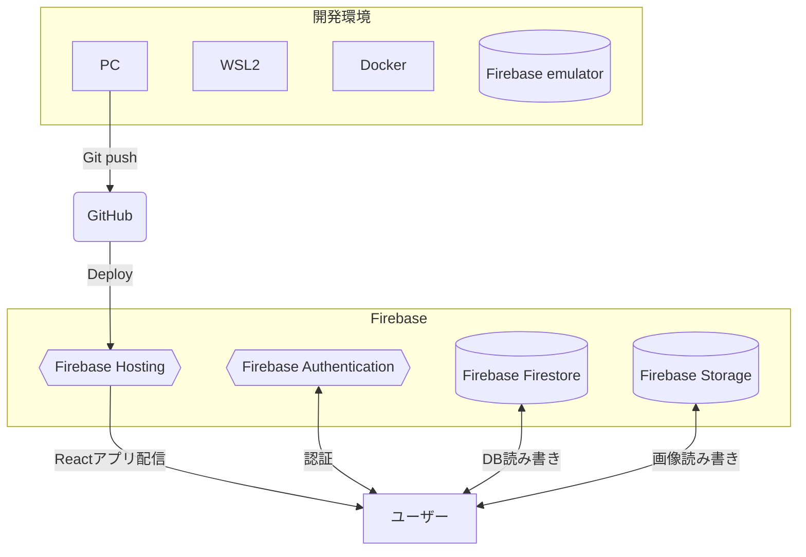
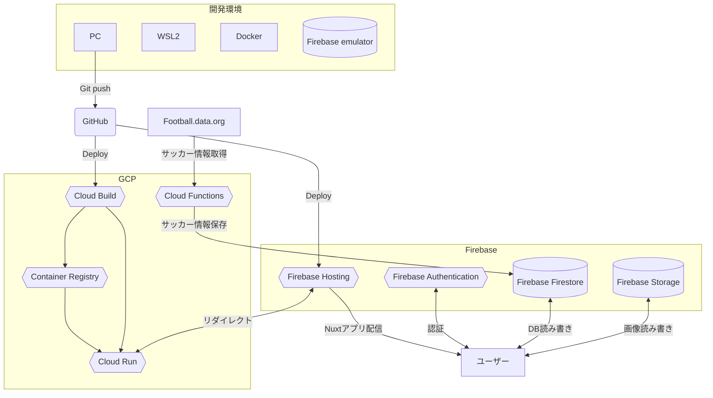

# 職務経歴書

## 基本情報

|key|value|
|---|---|
|氏名|荒木 裕登|
|ふりがな|あらき ゆうと|
|生年月日|1992年1月1日|
|居住地|東京都大田区|
|最終学歴|明治大学食料環境政策学科卒|
|エンジニア歴| 2019年11月～ |
|GitHub| <a src="https://github.com/ucho456" target="_blank">https://github.com/ucho456</a> |

  

## 業務経験のあるスキル（経験年数）
#### 言語
- Javascript （4年）
- Typescript （3年）

#### フロントエンドフレームワーク
- Next.js （1年）
- Vue.js （3年）

#### バックエンドフレームワーク
- Express （3年）
- Nest.js （1年)

#### データベース
- MySQL （3年）
- PostgreSQL （1年）
- Redis（1年）

  

## 職務経歴詳細

## 株式会社EARTHBRAIN（2022/11 ~ 現在）

### 建設業界のDX化を推進するIoTプラットフォームの新規開発
多数のIoT機器から集約したデータを見える化するプラットフォームの新規開発を担当しました。

#### 技術スタック
Typescript, Node.js(FW: Nest.js, ORM: Prisma), PostgreSQL, Next.js, Docker, GCP

Slack, Jira, Notion, Miro, Box, Gather, Figma

#### チーム構成
- OpenAPI開発チーム在籍時はPM1名 TL3名 コーダー10名前後でコーダーを担当
- 認可サーバーのフロントエンド開発チーム時はPM1名 TL1名 コーダー5名でTLを担当

#### 担当した役割
- OpenAPIの開発

  Nest.jsを使用してIoTプラットフォームに使うOpenAPIの開発・テスト・バグ改修などを行いました。参画前に既に仕様書が作成されている状態で、設計などは行わずコーダーとしての役割がメインでした。

- 認可サーバーのフロントエンドアーキテクト・開発

  フロントエンド開発の知見を買って頂き、TLとして認可サーバーのフロントエンド開発を行いました。技術選定、コーディング規約作成、Unit/VRT/E2Eテストの設計、スケジュール管理、認可サーバーの開発チームとインターフェイスの調整などを行いました。

#### 発揮したバリュー
- フロントエンドチームの育成

  ｓｓｓ

- コンポーネントのパッケージ化

  プラットフォームのフロントエンドと認可サーバーのフロントエンドのデザインを統一化する為に、Github packagesを使用してコンポーネントのパッケージ化を提案し実装しました。これによりコンポーネントを一元管理しながら様々なプロジェクトで使用できるようにしました。またStory bookを使用してコンポーネントのカタログ化をすることでデザインチームとのコミュニケーション改善に役立てて頂いたり、reg-suitを使用してVisual Regression Testingを行えるようにしました。

  

## 会社名：ピクオス株式会社（2019/11〜2022/10）

### 動物病院向けクラウド型レセコンサービスの開発
予約・電子カルテ・保険請求・会計・データ分析など動物病院が業務に必要な機能がシームレスに使用できるクラウド型レセコンサービスの新規開発を担当しました。

#### 技術スタック
Javascript, Typescript, Vue.js v2, Node.js(FW: Express, ORM: Sequelize), MySQL, GCP

Teams, Trello

#### チーム構成
PO1名、PM兼TL1名、コーダー4名のコーダー担当。

#### 担当した役割
要件定義・基本設計・詳細設計・フロントエンド開発・バックエンド開発・テスト・コードレビュー・運用保守などインフラ以外を全て担当していました。

#### 発揮したバリュー
- 非正規化によるDB設計の改善

  電子カルテの機能は変更履歴を管理する必要ありました。当時のDB設計ではカルテを変更する際に同一テーブルに新規レコードを作成する仕様で、フロントエンドでの表示時に最新のデータのみ表示するようフィルタリングが必要になったり、カルテの周辺データ（薬など）にも変更履歴の管理が必要になったりと仕様がどんどん複雑化していきました。そこでカルテの変更履歴を管理する専用のテーブルを非正規化してもつ仕様に変更を提案しました。結果としてシンプルに管理できるようになりました。
 
- Web Scoketでリアルタイム通信を実装

  １つの医院アカウントを複数の医師が使用するシステムの都合上、データをリアルタイムで共有する必要がありました。当時その方法としてフロント側でCron処理を行い1分毎にリクエストを発行し、最新データを取得するという仕組みを採用していた為、タイムラグが発生したり無駄なリクエストが発生していました。そこでWeb Socketの仕組みを使用できるSocket.ioを導入し、非同期双方向通信を実現した。これによりサーバー側のデータ変更をトリガーにフロントへ更新情報を伝える事が可能になりました。

  

## 個人開発

## Lite chat
React * Firebase * WebRTCを使った、ランダムでマッチした相手とチャットやビデオ通話を楽しめるコミュニケーションサービスです。業務でNext.jsを使用する事になったのでReactの知見を深める為の一環として自分のサービスを作成してみました。題材にチャットサービスを選んだ理由は、[Gather](https://www.gather.town/)というサービスのセンスが好きでWebRTC関連の技術を使ってみたいという興味があった事と、暇つぶし系のチャットアプリは沢山あるがインストール型が主流で『暇つぶしチャットアプリに興味はあるけどインストールするのは・・・』という層がいればそこそこ使って貰えるサービスになるのでは？と考えたからです。

### リポジトリURL

https://github.com/ucho456/lite-chat

### 公開URL

https://lite-chat.com?testUser=true

クエリに `testUser=true` をつけることでテストユーザーでサインインする事ができるボタンが表示されます。動作確認をする場合以下の手順で実行して下さい。

1. Google chrome で https://lite-chat.com?testUser=true にアクセス。
2. `太郎サインイン` ボタンで太郎としてサインイン。
3. `Ctrl + Shift + N` 又は `⌘+shift+n` でシークレットモードのブラウザを用意し、https://lite-chat.com?testUser=true にアクセス。
4. `花子サインイン` ボタンで花子としてサインイン。
5. チャットやビデオ通話の機能をお試して頂けます。（他のユーザーに迷惑のかかる行為はご遠慮下さい。）

### 使用技術一覧
React, Typescript, Material ui, Firebase, Docker, Github actions

### アーキテクチャ

### 主な機能
- サインイン・サインアウト
- プロフィール作成・編集
- ランダムマッチング
- メッセージ読み書き
- ビデオ通話

  

## Foot Repo
Nuxt.js * Firebase を使った、サッカーの選手採点の記事を作成しTwitterなどのSNSでシェアできるサービスです。サッカー観戦が好きで、選手採点記事を自分で作成して共有できるようなサービスがあったら面白いのでは？と思い作りました。しかし一記事作成の為に、最低11人分の評価をする必要があるなどハードルが高く思ったように使われませんでした。またユーザーに使用されない割に、サーバー代やサッカー情報を取得するAPIの使用料金などで毎月5千円程度の赤字だった為、サービスの公開を停止しました。

### リポジトリURL

https://github.com/ucho456/foot-repo

### 公開URL

~~https://foot-repo.com/~~

### 使用技術一覧
Nuxt.js, Typescript, Vuetify, Firebase, Cloud Run, Docker, Github actions

### アーキテクチャ

### 主な機能
- サインイン・サインアウト
- プロフィール作成・編集
- 記事投稿・編集・削除
- いいね
- ユーザーフォロー

